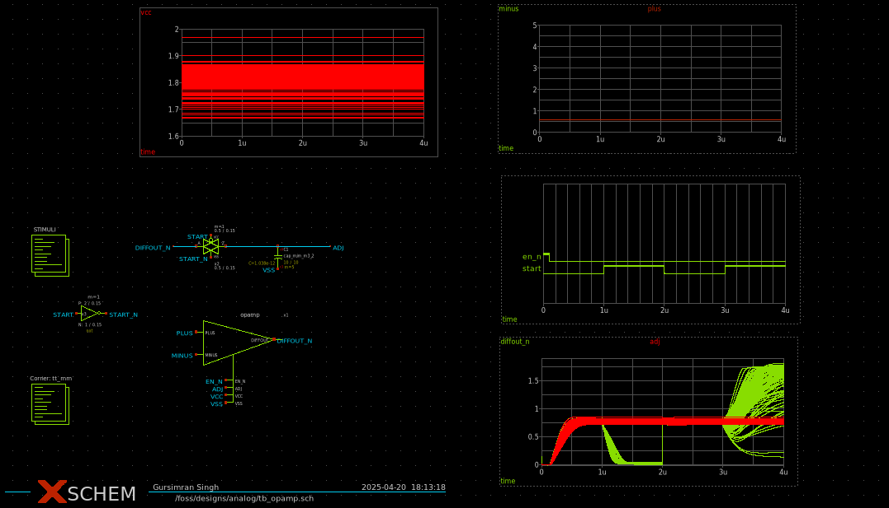
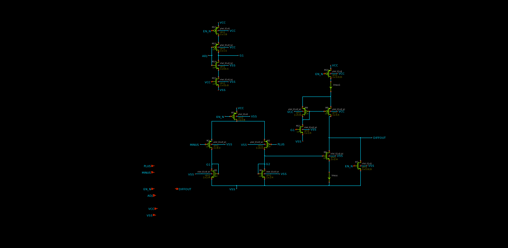

# Analog-IC-Design
Circuits that I write about in my free time.

## Design of an Operational Amplifier to detect milli-volt order signals.
Plots without gain stage. 

The circuit looks something like this

I used Xschem for the schematic entry and NGspice for simulations. [Youtube video](https://youtu.be/q3ZcpSkVVuc?si=RzX4Z9Q1VjEWSuFB) by efabless demysitifying Xschem. 
