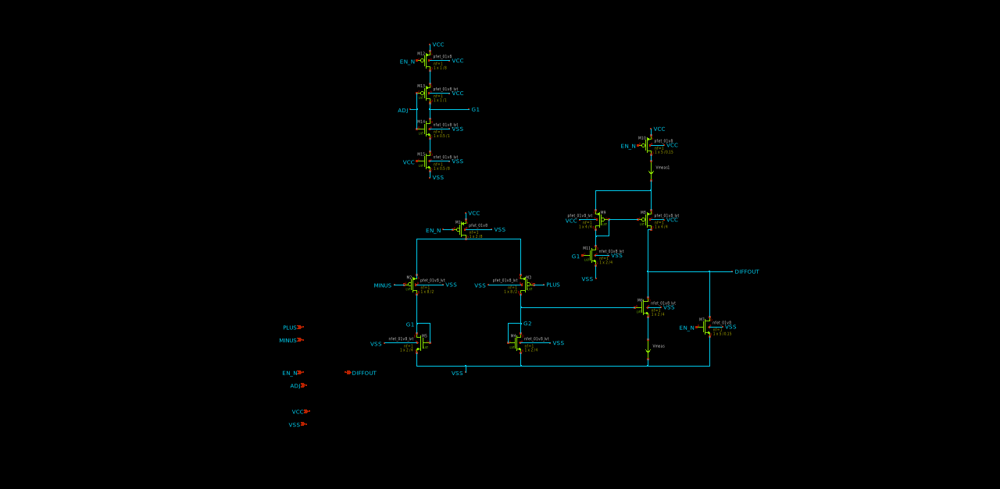
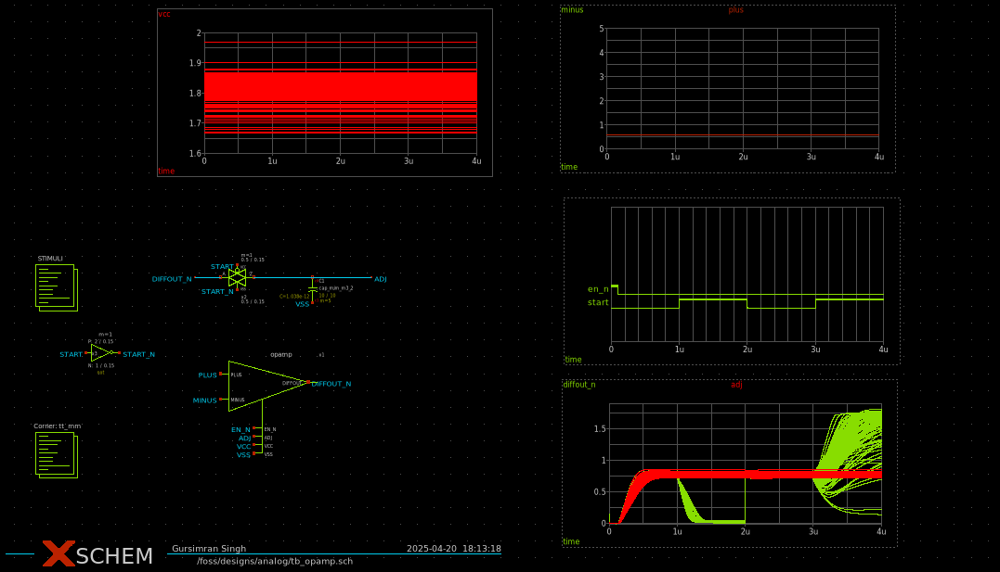

# Analog-IC-Design
Circuits that I write about in my free time.

## Design of a comparator to detect milli-volt order differential signal.
The design files are in the Xschem started folder.

Schematic without gain stage.

Plot of output, inputs and enable as well as gaussian sweep over VCC.

I used Xschem for the schematic entry and NGspice for simulations. [Youtube video](https://youtu.be/q3ZcpSkVVuc?si=RzX4Z9Q1VjEWSuFB) for reference.
